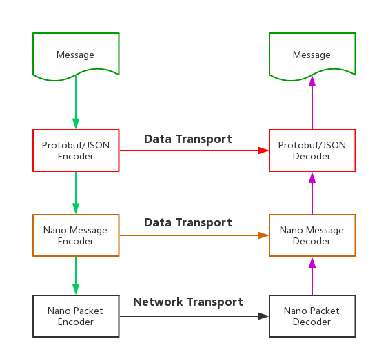
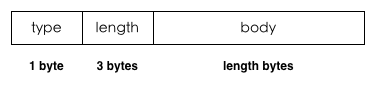
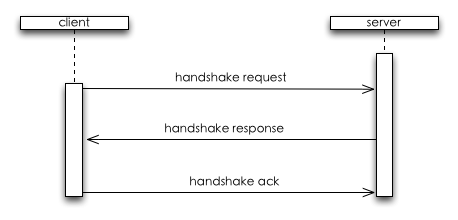
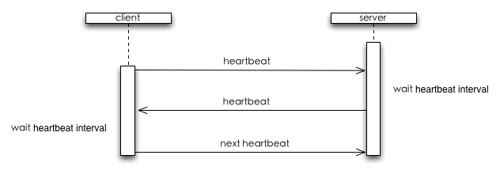
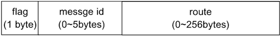
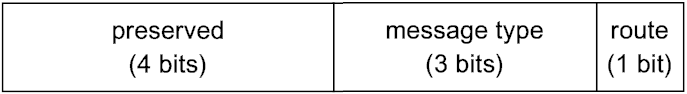
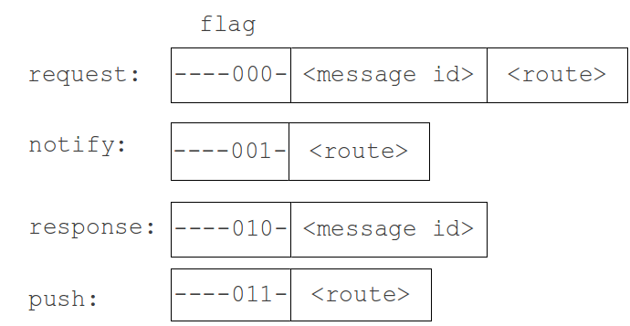
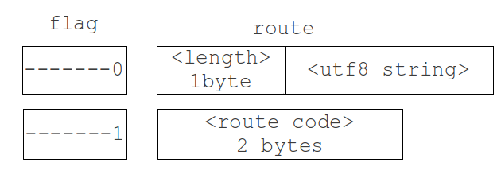

# Communication protocol

Nano's binary protocol can be divided into two layers: package layer and message layer. Message
layer works on route compression and protobuf/json encoding/decoding, and the result from message
layer will be passed to the package layer. The package layer provides a series of mechanisms
including  handshake, heartbeat and byte-stream-based message encoding/decoding. The result from
package layer can be transmitted on tcp or WebSocket. Both of the message layer and package layer
can be replaced independently since neither of them relies on each other directly.

The layers of nano protocol is shown as below :



## Nano Package

Package layer is used to encapsulate nano message for transmitting via a connection-oriented
communication such as tcp. There are two kinds of package: control package and data package.
The former is used to control the communication process such as handshake, heartbeat, and the
latter is used to transmit data between clients and servers.

#### Package Format

Nano package is composed of two parts: header and body. The header part describes type and
length of the package while body contains the binary payload which is encoded/decoded by
message layer. The format is shown as follows:



* type - package type, 1 byte
    - 0x01: package for handshake request from client to server and handshake response from server to client;
    - 0x02: package for handshake ack from client to server
    - 0x03: heartbeat package
    - 0x04: data package
    - 0x05: disconnect message from server
* length - length of body in byte, 3 bytes big-endian integer.
* body - binary payload.

#### Handshake

Handshake phase provides an opportunity to synchronize initialization data for client and
server after the connection is established. The handshake data is composed of two parts:
system and user. The system data is used by nano framework itself, while user data can be
customized by developers for particular purpose.

The handshake data is encoded to utf8 json string without compression and transmitted as
the body of the handshake package.

A handshake request is shown as follows:

```javascript
{
  "sys": {
    "version": "1.1.1",
    "type": "js-websocket"
  },
  "user": {
    // Any customized request data
  }
}
```

* sys.version - client version. Each version of client SDK should be assigned a constant
  version, and it should be uploaded to server during the handshake phase.
* sys.type - client type, such as C, android, iOS. Server can check whether it is compatible
  between server and client using sys.version and sys.type.

A handshake response is shown as follows:

```javascript
{
  "code": 200, // response code
  "sys": {
    "heartbeat": 3, // heartbeat interval in second
    "dict": {}, // route dictionary
  },
  "user": {
    // Any customized response data
  }
}
```

* code - response status code of handshake. 200 for ok, 500 for failure, 501 for non-compatible between server and client.
* sys.heartbeat - optional heartbeat interval in second, null for no heartbeat.
* dict - optional, route dictionary that used for route compression, null for disabling dictionary-based route compression .
* user - optional , user-defined data, it can be anything which could be JSONfied.

The process flow of handshake is shown as follows:



After the underlying connection is established, client sends handshake request to the server
with required data. Server will check the handshake request and then respond to this handshake
request. And then client sends handshake ack to server to finish handshake phase.

#### Heartbeat Package

A heartbeat package does not carry any data, so its length is 0 and its body is empty.

The process flow of heartbeat is shown as follows:



After handshaking phase, client will initiate the first heartbeat and then when server and
client receives a heartbeat package, it will delay for a heartbeat interval before sending
a heartbeat to each other back.

The heartbeat timeout is 2 times of heartbeat interval. Server will break a connection if
a heartbeat timeout detected. The action of client when it detects a heartbeat timeout
depends on the implementation by developers.

#### Data Package

Data package is used to transmit binary data between client and server. Package body is
passed from the upper layer and it can be arbitrary binary data, package layer does nothing
to the payload.

#### Disconnect Package

When server wants to break a client connection, such as kicking an online player off, it
will first sends a control message  and then breaks the connection. Client can use this
control message to determine whether server breaks the connection.

## Nano Message

Nano message layer does work on building message header. Different message types has different
header, so message header format is complex for it supporting several message types.

Message header is composed of three parts: flag, message id (a.k.a requestId), route. As
shown below:



As can be seen from the figure, nano message header is variant, depending on the particular
message type and content:

* flag is required and occupies one byte, which determines type of the message and format of
  the message content;
* message id and the route is optional. Message id is encoded using [base 128 varints](https://developers.google.com/protocol-buffers/docs/encoding#varints),
  and the length of message id is between the 0~5 bytes according to its value. The length of
  route is between 0~255 bytes according to type and content of the message.

### Flag Field

Flag occupies first byte of message header, its content is shown as follows:



Now we only use 4 bits and others are reserved, 3 bits for message type, the rest 1 bit for
route compression flag:
* Message type is used to identify the message type, it occupies 3 bits  that it can support 8 types from 0 to 7, and now we only use 0~3 to support 4 types of message: request, notify, response, push.
* The last 1 bit is used to indicate whether route compression is enabled, it will affect route field.
* These two parts are independent of each other.

### Message Type

Different message types is corresponding to different message header, message types is identified
by 2-4 bit of flag field. The relationship between message types and message header is presented
 as follows:



**-** The figure above indicates that the bit does not affect the type of message.

### Route Compression Flag

We use the last 1 bit(route compression flag) of flag field to identify if the route is compressed,
where 1 means it's a compressed route and 0 for un-compressed. Route field encoding/decoding depends
on this bit, the format is shown as follows:



As seen from the figure above:
* If route compression flag is 1 , route is a compressed route and it will be an uInt16 using which can obtain real route by querying the dictionary.
* If route compression flag is 0, route includes two parts, a uInt8 is  used to indicate the route string length in bytes and a utf8-encoded route string whose maximum length is limited to 256 bytes.

## Summary

This document describes the wire-protocol for nano, including package layer and message layer. When
developers uses nano underlying network library, they can implement client SDK for various platforms
according to the protocol illustrated here.


***Copyright***:Parts of above content and figures come from [Pomelo Protocol](https://github.com/NetEase/pomelo/wiki/Communication-Protocol)
