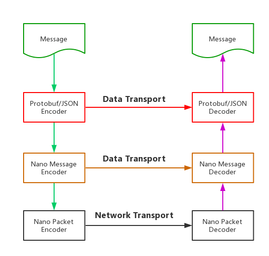
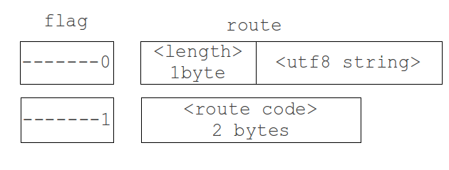

# 协议格式

`nano`的二进制协议包含两层编码：package和message。message层主要实现route压缩和protobuf压缩，message
层的编码结果将传递给package层。package层主要实现`nano`应用基于二进制协议的握手过程，心跳和数据传输编码，
package层的编码结果可以通过tcp，websocket等协议以二进制数据的形式进行传输。message层编码可选，也可替换
成其他二进制编码格式，都不影响package层编码和发送。

`nano`协议层的结构如下图所示：



## Nano Package

package协议主要用来封装在面向连接的二进制流的通讯协议（如：tcp）上的`nano`数据包。package分为控制包和数
据包两种类型。前者用来实现`nano`应用层面的控制流程，包括客户端和服务器的握手，心跳和服务器主动断开连接的通
知等控制信息。后者则是用来在客户端和服务器之间传输应用数据。

#### Package Format

package分为header和body两部分。header描述package包的类型和包的长度，body则是需要传输的数据内容。具体
格式如下：


* type - package类型，1个byte，取值如下。
	- 0x01: 客户端到服务器的握手请求以及服务器到客户端的握手响应
	- 0x02: 客户端到服务器的握手ack
	- 0x03: 心跳包
	- 0x04: 数据包
	- 0x05: 服务器主动断开连接通知
* length - body内容长度，3个byte的大端整数，因此最大的包长度为2^24个byte。
* body - 二进制的传输内容。

各个package类型的具体描述和控制流程如下。

#### 握手(Handshake Package)

握手流程主要提供一个机会，让客户端和服务器在连接建立后，进行一些初始化的数据交换。交换的数据分为系统和用
户两部分。系统部分为Nano框架所需信息，用户部分则是用户可以在具体应用中自定义的内容。

握手的内容为utf-8编码的json字符串（不压缩），通过body字段传输。

握手请求：


```javascript
{
  "sys": {
    "version": "1.1.1",
    "type": "js-websocket"
  },
  "user": {
    // Any customized request data
  }
}
```

* sys.version - 客户端的版本号。每个客户端SDK的每一个版本都有一个固定的版本号。在握手阶段客户端将该版本
号上传给服务器，服务器可以由此来判断当前客户端是否合适与服务器通讯。
* sys.type - 客户端的类型。可以通过客户端类型和版本号一起来确定客户端是否合适。

握手响应：

```javascript
{
  "code": 200, // response code
  "sys": {
    "heartbeat": 3, // heartbeat interval in second
    "dict": {}, // route dictionary
  },
  "user": {
    // Any customized response data
  }
}
```

* code - 握手响应的状态码。目前的取值：200代表成功，500为处理用户自定义握手流程时失败，501为客户端版
本号不符合要求。
* sys.heartbeat - 可选，心跳时间间隔，单位为秒，没指定表示不需要心跳。
* dict - 可选，route字段压缩的映射表，没指定表示没有字典压缩。
* protos - 可选，protobuf压缩的数据定义，没有表示没有protobuf压缩。
* user - 可选，用户自定义的握手数据，没有表示没有用户自定义的握手数据。

握手的流程如下：


当底层连接建立后，客户端向服务器发起握手请求，并附带必要的数据。服务器检验握手数据后，返回握手响应。如果
握手成功，客户端向服务器发送一个握手ack，握手阶段至此成功结束。

#### 心跳(Heartbeat Package)

心跳包的length字段为0，body为空。

心跳的流程如下：


服务器可以配置心跳时间间隔。当握手结束后，客户端发起第一个心跳。服务器和客户端收到心跳包后，延迟心跳间隔
的时间后再向对方发送一个心跳包。

心跳超时时间为2倍的心跳间隔时间。服务器检测到心跳超时并不会主动断开客户端的连接。客户端检测到心跳超时，可
以根据策略选择是否要主动断开连接。

#### 数据

数据包用来在客户端和服务器之间传输数据所用。数据包的body是由上层传下来的任意二进制数据，package层不会
对body内容做任何处理。

#### 服务器主动断开

当服务器主动断开客户端连接时（如：踢掉某个在线玩家），会先向客户端发送一个控制消息，然后再断开连接。客户
端可以通过这个消息来判断是否是服务器主动断开连接的。

## Nano Message

message协议的主要作用是封装消息头，包括route和消息类型两部分，不同的消息类型有着不同的消息头，在消息头
里面可能要打入message id(即requestId)和route信息。由于可能会有route压缩，而且对于服务端push的消息，
message id为空，对于客户端请求的响应，route为空，因此message的头格式比较复杂。

消息头分为三部分，flag，message id，route。如下图所示：


从上图可以看出，Nano消息头是可变的，会根据具体的消息类型和内容而改变。其中：
* flag位是必须的，占用一个byte，它决定了后面的消息类型和内容的格式; 
* message id和route则是可选的。其中message id采用[varints 128变长编码](https://developers.google.com/protocol-buffers/docs/encoding#varints)方式，根据值的大小，长度在0～5byte之间。route则根据消息类型以及内容的大小，长度在0～255byte之间。

### 标志位(flag)

flag占用message头的第一个byte，其内容如下


现在只用到了其中的4个bit，这四个bit包括两部分，占用3个bit的message type字段和占用1个bit的route标识，其中：
* message type用来标识消息类型,范围为0～7，现在消息共有四类，request，notify，response，push，值的范围
是0～3。不同的消息类型有着不同的消息内容，下面会有详细分析。
* 最后一位的route表示route是否压缩，影响route字段的长度。

这两部分之间相互独立，互不影响。

### 消息类型(Message Type)

不同类型的消息，对应不同消息头，消息类型通过flag字段的第2-4位来确定，其对应关系以及相应的消息头如下图：


上面的 **-** 表示不影响消息类型的bit位。

### 路由压缩标志(Route Compression Flag)

route主要分为压缩和未压缩两种，由flag的最后一位（route压缩标志位）指定，当flag中的route标志为0时，表示未压
缩的route，为1则表示是压缩route。route通过系统生成和用户自定义的字典进行压缩，具体内容见[压缩协议](./route_compression_zh_CN.md)。
route字段的编码会依赖flag的这一位，其格式如下图:



上图是不同的flag标志对应的route字段的内容：
* flag的最后一位为1时，后面跟的是一个uInt16表示的route字典编号，需要通过查询字典来获取route;
* flag最后一位为0是，后面route则由一个uInt8的byte，用来表示route的字节长度。之后是通过utf8编码后的route字
符串，其长度就是前面一位byte的uInt8的值，因此route的长度最大支持256B。
## Summary

在本部分，介绍了Nano提供的hybridconnector的线上协议，包括package层和message层。当用户使用nano作为网络层库
的时候，可以根据这里提供的协议信息，在客户端可以依据此协议完成与服务端的通信。

***Copyright***:以上的部分内容与图表来自于[Pomelo Protocol](https://github.com/NetEase/pomelo/wiki/Communication-Protocol)
